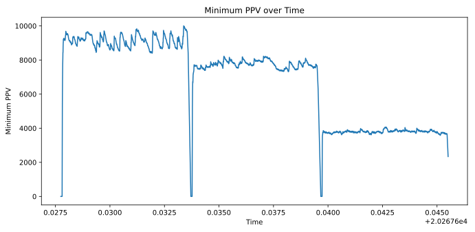
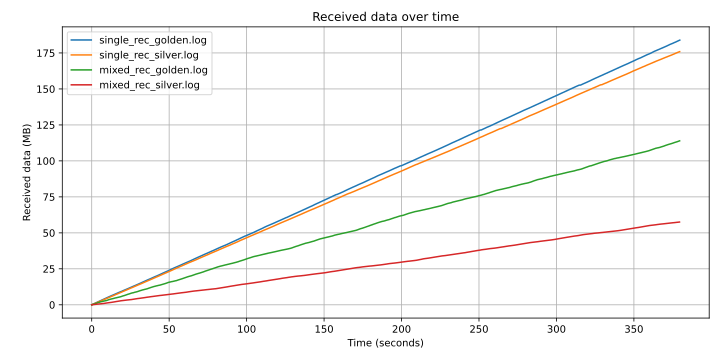

# Implementation of PPV Remarking


This project was created for our master's course "Programmable Networks" at ELTE. It is a student project that partially implements the following paper: [Stateless Resource Sharing in Networks with Multi-Layer Virtualization by Szilveszter Nadas, Zoltan Turanyi, Gergo Gombos, Sandor Laki](https://doi.org/10.1109/ICC.2019.8761720).

Our implementation ([@horcsinbalint](https://github.com/horcsinbalint) - Bálint Horcsin, [@kristofy](https://github.com/kristofy) - Kristóf Osztopáni) targets the [BMv2 switch](https://github.com/p4lang/behavioral-model).

## Introduction

[The paper](https://doi.org/10.1109/ICC.2019.8761720) proposes a solution for scenarios where a physical network (PN) infrastructure is shared by multiple virtual networks (VN), and the PN must prioritize packets in some way. The authors suggest assigning a value to each packet (per-packet-value: PPV), allowing overloaded switches within the network to drop packets based on their PPV. This value represents the reward the network receives if the packet is successfully delivered.

The challenge lies in considering both the value the VN assigns to the packet (e.g., TCP traffic is typically more valuable than UDP) and the value the VN has for the PN. To address this, the authors propose that PNs should remark the PPV of all packets as they enter the edge of their infrastructure.

In our project, we implemented the following components in the [`switch_program.p4`](switch_program.p4) data-plane program and the [`controller.py`](controller.py) controller:

- IPv4 forwarding based on static routes ([see details](#ipv4-forwarding-based-on-static-routes))
- PPV marking ([see details](#ppv-marking))
- PPV remarking ([see details](#ppv-remarking))
- Dropping based on the PPV value ([see details](#ppv-based-dropping))
- Measuring the load on the switch ([see details](#measuring-the-load-on-the-switch))
- Adjusting the PPV limit ([see details](#adjusting-the-ppv-limit))
- Dropping when overloading happens ([see details](#dropping-under-overload))
- Removing PPV marking if necessary ([see details](#removing-ppv-marking-if-necessary))

We also developed a [testing facility](#testing).

The topology is built by [`network.py`](network.py). Both [`network.py`](network.py) and [`controller.py`](controller.py) use [`configuration.py`](configuration.py).

## Usage

To start the switches, run `make start_switches` which generates some p4 code (with [`script_generator.py`](script_generator.py)) and launches the mininet CLI.

You may run these to run our tests:

- `make plot`: shows the data that is received during each test (automatically updates every second)
- `make plot_minimum_ppv`: shows the minimum PPV that a packet is needed to reach or it will be dropped by the switch (automatically updates every second)
- `make run_simulation`: which performs our test (it also runs the controller)
- `make plot_pdf`: to export the same data that is shown in `make plot`

If you would like to simply run the controller, you can use `make controller`.


### Environment

Our project uses [p4-utils](https://github.com/nsg-ethz/p4-utils), and we relied on the virtual machine provided by that project.

### Python dependencies

All required Python packages are listed in `requirements.txt`. You can install them with:

```bash
pip install -r requirements.txt
```

## Packet Switching

*For an overview of all components, see [Introduction](#introduction).*

### IPv4 Forwarding Based on Static Routes

This is implemented using the `ipv4_lpm` table, which performs a lookup on the IPv4 packet's `dstAddr`. We use `lpm` (longest prefix match) so that subnets can also be matched. The parameters of the forwarding action `ipv4_forward` are the target's MAC address and the switch port to which the packet should be sent. In our tests, the PPV ranged from `0` to `2^16-1=65535` (inclusive).

*See also: [Testing](#testing) for how forwarding is validated.*

### PPV Marking

To store the PPV value, we implemented the `ppv_t` header, which is inserted inside the IPv4 header. If a `ppv_t` header is present, the IPv4 header's protocol is set to `0x094` (`TYPE_PPV`), and the original protocol is stored in `ppv_t`. The packet's value is stored within the `ppv_t` header. The `ppv_marker` table is applied based on the IPv4 source address and protocol (we only performed remarking for TCP and UDP). While the `ppv_mark` action requires a value, we initially assigned the maximum value of `65535` and then remarked it.

### PPV Remarking

PPV remarking is performed by applying the `ppv_remarker` table. This table matches on the ingress port, and the `ppv_remark` action requires a `traffic_type` (0 for golden, 1 for silver traffic) and a `bin_number`.

We calculate the incoming packet rate using 5 bins, which are stored in the `old_bins` and `future_bins` registers. By analyzing how many bytes of data have higher or similar priority within a given time frame using `old_bins`, we can randomize the _Quantized Empirical TVF_. Once we obtain the _Quantized Empirical TVF_ (`randomized_throughput` in the code), we need to assign a new value.

The original paper used division to calculate the new value. We also used division, the new PPV for a packet from a golden VN is `65535*900/(randomized_throughput+900)`, and the packet's value from a silver VN is `65535*900/2/(randomized_throughput+900)`. The problem with this approach is that we need to do a division where the divisor might not be a power of two so BMv2 does not have support for this operation.

For this, we construct the quotient as a 16-bit integer from the most significant to least significant bit, checking for each bit if it is required. [`script_generator.py`](script_generator.py) generates 16 tables which can be applied one after the other. When we tried to put all of these statements one-after-the-other in a single action, the code did not compile in a reasonable timeframe. Most probably the reason for it was that it generated all `2^16=65536` paths the code could have taken. By putting them in separate actions, we could circumvent this limitation.

`future_bins` and `old_bins` are updated periodically by our controller. It is also possible to move this process inside the data plane by sending a special packet. The current approach has the potential for race conditions, but the proof of concept works nonetheless.

### PPV-Based Dropping

We maintain a minimum PPV value in the register `minimum_ppv_reg`. If a packet does not meet this value, it is dropped.

### Measuring the Load on the Switch

We employ the `ipv4_meter` table, which serves as a meter to indicate whether the switch is overloaded.

The settings for these are stored in [`metered_switches_settings.json`](metered_switches_settings.json).

### Adjusting the PPV Limit

If the switch is overloaded, the minimum PPV value is increased. The controller periodically decreases the minimum PPV value (it faces a similar challenge as manipulating `future_bins` and `old_bins`). According to our measurements, this value roughly fluctuates around some value for each type of load. The following plot shows the minimum PPV for three different scenarios over time.



### Dropping Under Overload

If the meter in the `ipv4_meter` table's meter indicates `RED`, the packet is dropped.

### Removing PPV Marking if Necessary

When a packet is delivered to the host, the PPV header is removed by the `ppv_demarker` table's `ppv_demark` action. This is matched using the IPv4 header's `dstAddr` with `lpm`.

## Testing

We evaluated our implementation using a single switch connected to four hosts with the topology that you can find below:


We tested the forwarding rules by invoking `pingall` in the mininet terminal.

During testing, we generated TCP packets as golden traffic, injecting them into `s1-eth1` with `h3` as the destination. For silver traffic, we generated UDP packets injected into `s1-eth2` destined for `h4`. We monitored the number of received bytes by sniffing `s1-eth3` and `s1-eth4`, as implemented in [`send_receive.py`](send_receive.py).

[`interval_traffic_script.py`](interval_traffic_script.py) starts the controller three times: first with both golden and silver traffic running, then separately for each. The number of received bytes can be viewed live with `make plot` (which updates every second), and results can be exported to a PDF using `make plot_pdf`.

The figure below shows the data received over time.



Our implementation performs well: golden traffic achieves a higher rate than silver traffic when both loads are present, and the available bandwidth is almost always fully utilized.

## Difficulties during the development

We had difficulties while solving several problems. We implemented [`plot_data_rate.py`](plot_data_rate.py) and [`plot_minimum_ppv.py`](plot_minimum_ppv.py) to have interactive plots where we could see the throughput during testing. We had to implement our own division as BMv2 does not have a division function.

The logic we used was quite complex so the performance of BMv2 was inconsistent, making our measurements difficult.

## Results

We successfully implemented PPV remarking for the BMv2 switch. Our measurements show that the calculations for the bins, the _Quantized Empirical TVF_, and the new values are correct.

Overall, the project was a success.

## Future development options

- Decreasing the PPV limit could be done on the dataplane instead of the controller
- More measurements with different topologies could be done
- Multiple bins could be used for remarking
- Targets that are not BMv2 could also be used